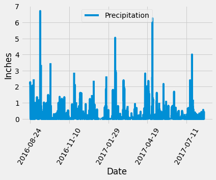
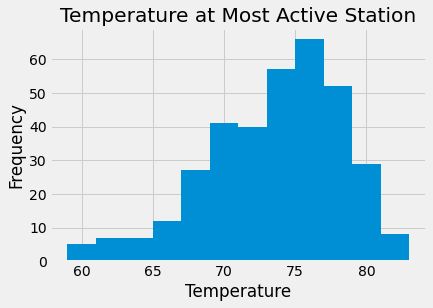

# Surfs Up!
## Climate Analysis and Exploration

||
|:--|
|**Precipitation in Hawaii for the last year of data (08/23/2016 - 08/23/2017)**|

||
|:--|
|**Temperature (F) at Hawaii's most active station for the last year of data (08/23/2016 - 08/23/2017)**|

## Climate App

Available Routes:

- /api/v1.0/precipitation

- /api/v1.0/stations

- /api/v1.0/tobs

- /api/v1.0/\<YYYY-MM-DD>

- /api/v1.0/\<YYYY-MM-DD>/\<YYYY-MM-DD>